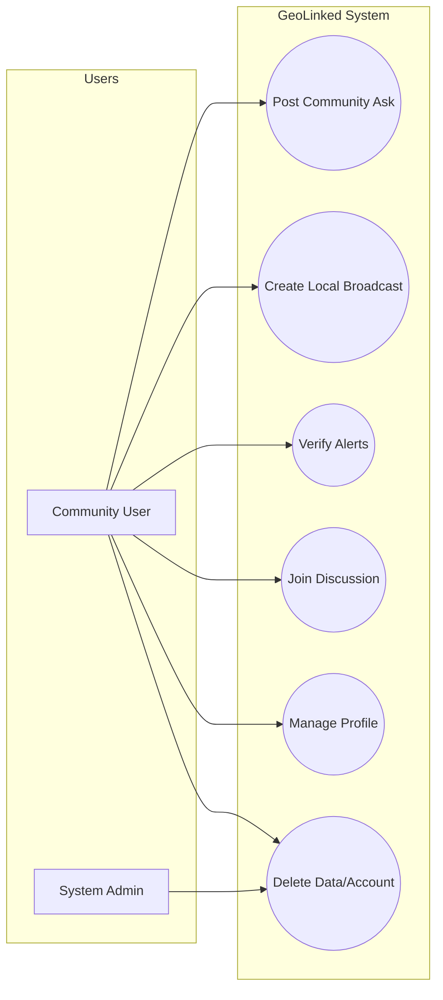
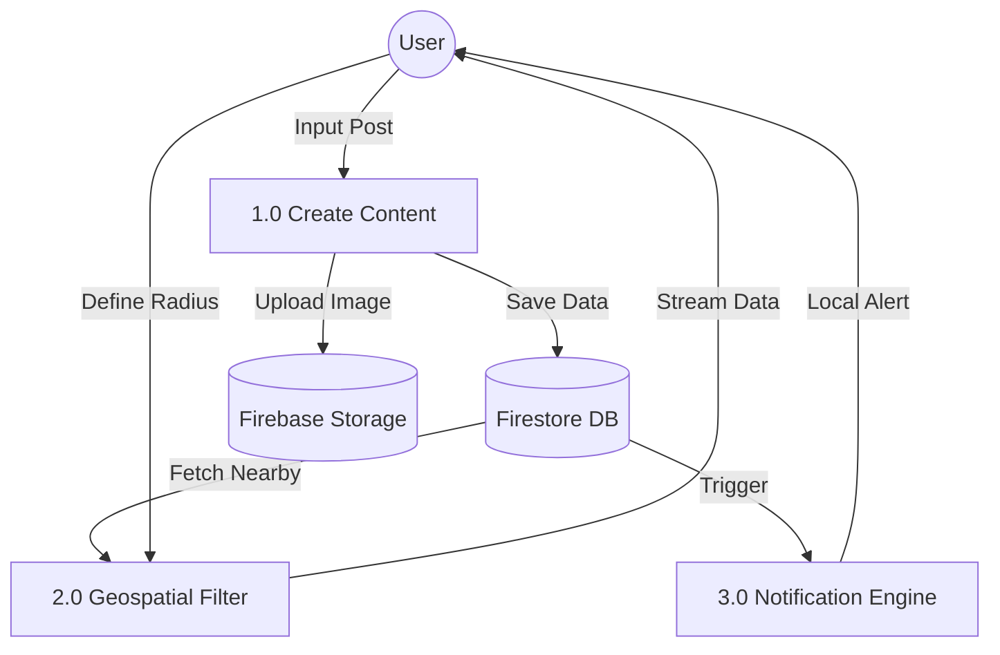
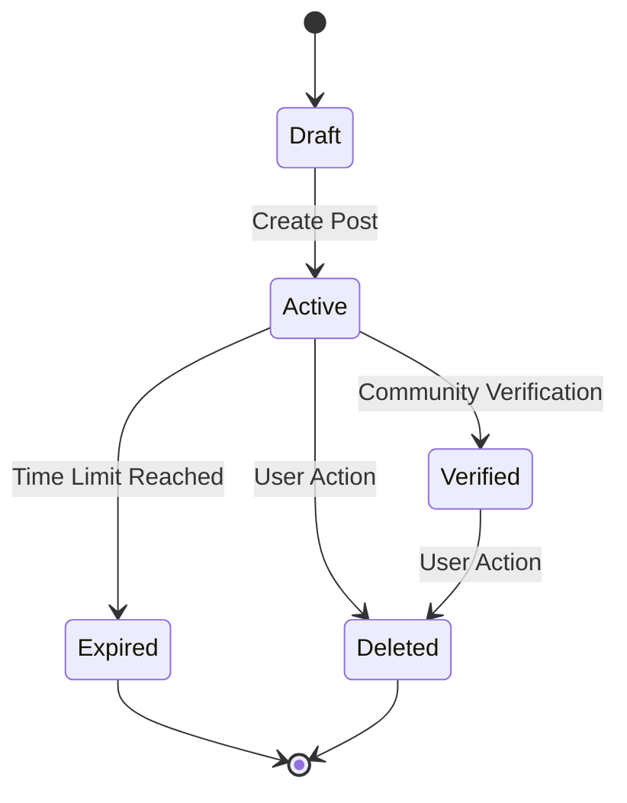
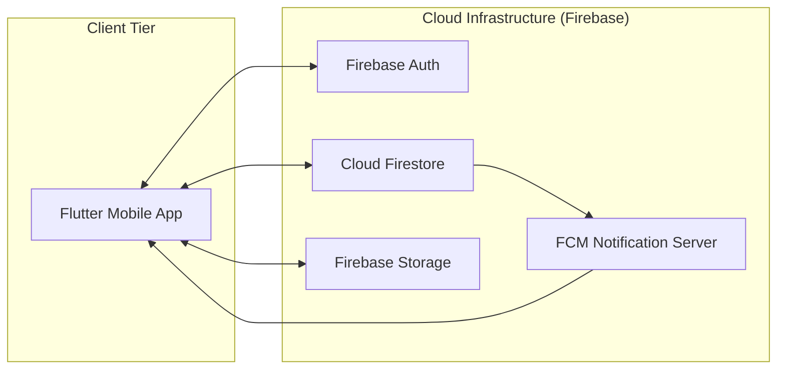
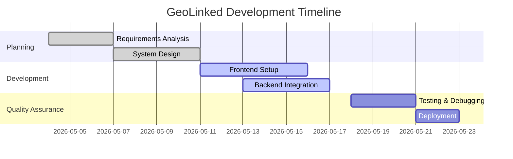

# PROJECT REPORT: GeoLinked - Hyper-Local Community Messaging
**Course**: Software Engineering (SEN-220)  
**Instructor**: Ms. Hadiqua Fazal  
**Semester**: Spring 2026 (4th Semester)  
**Group Members**: Suleman Gul, Ahmed Luqman, Muhammad Hassaan  

---

## 1. Project Overview & Foundation
### 1.1 Abstract
GeoLinked is a location-based social utility designed to bridge the gap between physical proximity and digital communication. By utilizing geohash-based geospatial queries, the system allows users to "Ask" and "Broadcast" information to a specific map radius, fostering real-time community assistance and local awareness.

### 1.2 System Scope
The project encompasses the full SDLC, from requirement elicitation to cloud deployment. It addresses the lack of real-time local information by providing a map-centric platform where location is the primary filter for content distribution.

---

## 2. Requirements Analysis
### 2.1 Functional Requirements
- **FR1: Map Interaction**: Users must be able to view nearby activity via interactive markers.
- **FR2: Geospatial Queries**: Users must be able to define a search radius (500m - 5km) for Asks.
- **FR3: Real-Time Alerts**: The system must provide instant notifications for high-severity broadcasts.
- **FR4: Media Support**: Users can attach and view photos with pinch-to-zoom functionality.
- **FR5: Data Sovereignty**: Users must be able to permanently delete their account and associated media.

### 2.2 Non-Functional Requirements
- **Performance**: Map markers should load within <2 seconds using parallel data fetching.
- **Scalability**: Backend must handle concurrent geospatial writes via Geohashing.
- **Security**: Granular Firestore rules to ensure only owners can modify their data.

---

## 3. Modeling Diagrams

### 3.1 Use Case Diagram

### 3.2 Data Flow Diagram (DFD Level 1)

### 3.3 State Transition Diagram (Post Lifecycle)

### 3.4 Network & Deployment Diagram

---

## 4. Design Artifacts (UI/UX)
The application utilizes a **Dark-Mode First** design system with a map-centric UI.
- **Main Map**: Interactive Google Maps interface with custom markers for Asks and Broadcasts.
- **Discussion Screen**: Real-time thread view with support for media zoom.
- **Profile**: Minimalist dashboard for settings and data control.

---

## 5. Tools and Technologies
- **Frontend**: Flutter (Dart) - Chosen for cross-platform high-performance rendering.
- **State Management**: Riverpod - For robust reactive data streaming.
- **Backend/Database**: Firebase (NoSQL Firestore) - To support real-time geospatial geohashing.
- **Maps**: Google Maps SDK - For industry-standard location services.

---

## 6. Risk Register
| ID | Risk Description | Probability | Impact | Mitigation Strategy |
| :--- | :--- | :--- | :--- | :--- |
| R1 | High API Costs (Maps) | Medium | High | Implement 1000ms debouncing on search queries. |
| R2 | Data Latency | Low | Medium | Use parallel initialization for location and data streams. |
| R3 | User Privacy Breach | High | High | Implement Geohashing to anonymize exact user paths. |

---

## 7. Project Management Charts

### 7.1 Gantt Chart

### 7.2 CPM Chart (Critical Path)
**Critical Path**: Requirements → Design → Backend Integration → Testing → Deployment.
*Dependency Check*: Frontend UI development can run in parallel with Backend setup, but Integration cannot start until both are stable.

---

## 8. Participation & Progress Report
| Member | Role | Contribution |
| :--- | :--- | :--- |
| **Suleman Gul** | Team Lead / Backend | Firestore architecture, Geohashing, and API Integration. |
| **Ahmed Luqman** | Frontend Developer | Google Maps integration and Search Debouncing. |
| **Muhammad Hassaan** | UI-UX / Tester | Media zooming functionality and QA testing. |

---

## 9. Conclusion
GeoLinked successfully demonstrates the application of modern software engineering principles to solve local communication gaps. By integrating real-time geospatial processing with a user-centric design, the system provides a scalable solution for community engagement.
